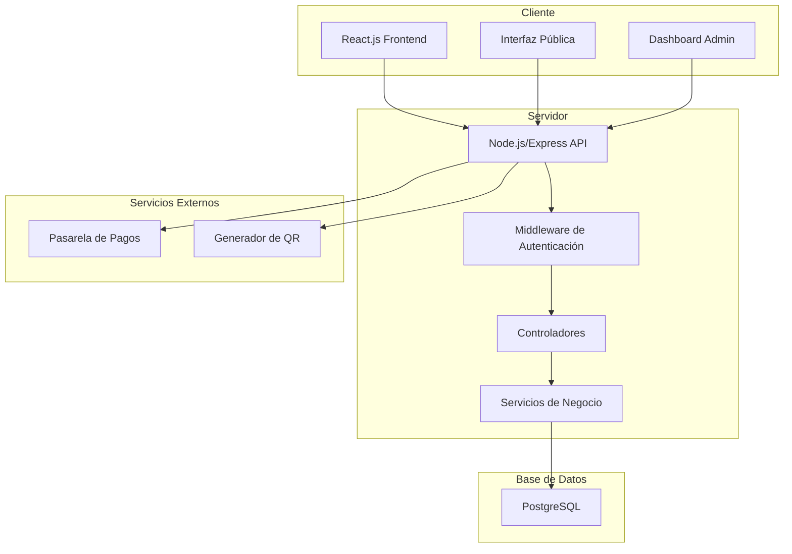

# Documento de Diseño

## Visión General

La plataforma de gestión de restaurantes será una aplicación web full-stack construida con una arquitectura de cliente-servidor separada. El frontend será una Single Page Application (SPA) desarrollada en React.js que se comunicará con una API REST construida en Node.js/Express. Los datos se almacenarán en PostgreSQL y la autenticación se manejará mediante tokens JWT.

## Arquitectura

### Arquitectura General del Sistema



### Estructura de Directorios

```
restaurant-platform/
├── client/                     # Frontend React.js
│   ├── public/
│   ├── src/
│   │   ├── components/         # Componentes reutilizables
│   │   ├── pages/             # Páginas principales
│   │   ├── hooks/             # Custom hooks
│   │   ├── services/          # Servicios API
│   │   ├── utils/             # Utilidades
│   │   ├── styles/            # Estilos CSS
│   │   └── context/           # Context API
│   └── package.json
├── server/                     # Backend Node.js
│   ├── src/
│   │   ├── controllers/       # Controladores de rutas
│   │   ├── models/            # Modelos de datos
│   │   ├── routes/            # Definición de rutas
│   │   ├── middleware/        # Middleware personalizado
│   │   ├── services/          # Lógica de negocio
│   │   ├── utils/             # Utilidades del servidor
│   │   └── config/            # Configuraciones
│   ├── migrations/            # Migraciones de BD
│   └── package.json
└── database/                   # Scripts de BD
    ├── schema.sql
    └── seeds.sql
```

## Componentes e Interfaces

### Frontend - Componentes React

#### Componentes Principales

1. **App.js** - Componente raíz con routing
2. **AuthProvider** - Context para manejo de autenticación
3. **PrivateRoute** - Componente para rutas protegidas

#### Páginas (Pages)

1. **LoginPage** - Página de autenticación
2. **DashboardPage** - Panel principal del administrador
3. **MenuManagementPage** - Gestión de menús
4. **OrdersPage** - Gestión de pedidos
5. **RestaurantInfoPage** - Información del restaurante
6. **PublicMenuPage** - Interfaz pública del menú

#### Componentes Reutilizables

1. **MenuItemCard** - Tarjeta para elementos del menú
2. **OrderCard** - Tarjeta para pedidos
3. **QRCodeGenerator** - Generador de códigos QR
4. **LoadingSpinner** - Indicador de carga
5. **Modal** - Modal reutilizable
6. **FormInput** - Input de formulario con validación

### Backend - API REST

#### Estructura de Rutas

```
/api/v1/
├── /auth
│   ├── POST /login
│   ├── POST /logout
│   └── GET /verify
├── /restaurants
│   ├── GET /:id
│   └── PUT /:id
├── /menu
│   ├── GET /
│   ├── POST /
│   ├── PUT /:id
│   └── DELETE /:id
├── /orders
│   ├── GET /
│   ├── POST /
│   ├── PUT /:id/status
│   └── GET /:id/qr
└── /payments
    ├── POST /process
    └── GET /verify/:orderId
```

#### Controladores

1. **AuthController** - Manejo de autenticación
2. **RestaurantController** - Gestión de información del restaurante
3. **MenuController** - CRUD de elementos del menú
4. **OrderController** - Gestión de pedidos
5. **PaymentController** - Procesamiento de pagos

## Modelos de Datos

### Esquema de Base de Datos PostgreSQL

```sql
-- Tabla de restaurantes
CREATE TABLE restaurants (
    id SERIAL PRIMARY KEY,
    name VARCHAR(255) NOT NULL,
    description TEXT,
    address TEXT,
    phone VARCHAR(20),
    email VARCHAR(255) UNIQUE NOT NULL,
    logo_url VARCHAR(500),
    opening_hours JSONB,
    created_at TIMESTAMP DEFAULT CURRENT_TIMESTAMP
);

-- Tabla de usuarios del sistema
CREATE TABLE users (
    id SERIAL PRIMARY KEY,
    restaurant_id INTEGER NOT NULL REFERENCES restaurants(id) ON DELETE CASCADE,
    username VARCHAR(100) UNIQUE NOT NULL,
    email VARCHAR(255) UNIQUE NOT NULL,
    password_hash VARCHAR(255) NOT NULL,
    role VARCHAR(50) DEFAULT 'admin' CHECK (role IN ('admin', 'manager', 'staff')),
    created_at TIMESTAMP DEFAULT CURRENT_TIMESTAMP
);

-- Tabla de categorías de menú
CREATE TABLE categories (
    id SERIAL PRIMARY KEY,
    restaurant_id INTEGER NOT NULL REFERENCES restaurants(id) ON DELETE CASCADE,
    name VARCHAR(255) NOT NULL,
    description TEXT,
    display_order INTEGER DEFAULT 0
);

-- Tabla de elementos del menú
CREATE TABLE menu_items (
    id SERIAL PRIMARY KEY,
    restaurant_id INTEGER NOT NULL REFERENCES restaurants(id) ON DELETE CASCADE,
    category_id INTEGER REFERENCES categories(id) ON DELETE SET NULL,
    name VARCHAR(255) NOT NULL,
    description TEXT,
    price DECIMAL(10,2) NOT NULL CHECK (price >= 0),
    image_url VARCHAR(500),
    available BOOLEAN DEFAULT true,
    created_at TIMESTAMP DEFAULT CURRENT_TIMESTAMP
);

-- Tabla de pedidos
CREATE TABLE orders (
    id SERIAL PRIMARY KEY,
    restaurant_id INTEGER NOT NULL REFERENCES restaurants(id) ON DELETE CASCADE,
    customer_name VARCHAR(255) NOT NULL,
    customer_phone VARCHAR(20),
    items JSONB NOT NULL,
    total_amount DECIMAL(10,2) NOT NULL CHECK (total_amount >= 0),
    status VARCHAR(50) DEFAULT 'pending' CHECK (status IN ('pending', 'confirmed', 'preparing', 'ready', 'delivered', 'cancelled')),
    payment_status VARCHAR(50) DEFAULT 'pending' CHECK (payment_status IN ('pending', 'paid', 'failed', 'refunded')),
    created_at TIMESTAMP DEFAULT CURRENT_TIMESTAMP
);

-- Tabla de pagos
CREATE TABLE payments (
    id SERIAL PRIMARY KEY,
    order_id INTEGER NOT NULL REFERENCES orders(id) ON DELETE CASCADE,
    qr_image_url VARCHAR(500),
    payment_method VARCHAR(100),
    amount DECIMAL(10,2) NOT NULL CHECK (amount >= 0),
    status VARCHAR(50) DEFAULT 'pending' CHECK (status IN ('pending', 'completed', 'failed', 'cancelled')),
    uploaded_at TIMESTAMP DEFAULT CURRENT_TIMESTAMP
);

-- Índices para optimizar consultas
CREATE INDEX idx_users_restaurant_id ON users(restaurant_id);
CREATE INDEX idx_users_email ON users(email);
CREATE INDEX idx_categories_restaurant_id ON categories(restaurant_id);
CREATE INDEX idx_categories_display_order ON categories(display_order);
CREATE INDEX idx_menu_items_restaurant_id ON menu_items(restaurant_id);
CREATE INDEX idx_menu_items_category_id ON menu_items(category_id);
CREATE INDEX idx_menu_items_available ON menu_items(available);
CREATE INDEX idx_orders_restaurant_id ON orders(restaurant_id);
CREATE INDEX idx_orders_status ON orders(status);
CREATE INDEX idx_orders_payment_status ON orders(payment_status);
CREATE INDEX idx_orders_created_at ON orders(created_at);
CREATE INDEX idx_payments_order_id ON payments(order_id);
CREATE INDEX idx_payments_status ON payments(status);

-- Constraints adicionales
ALTER TABLE categories ADD CONSTRAINT unique_category_name_per_restaurant 
    UNIQUE (restaurant_id, name);

ALTER TABLE menu_items ADD CONSTRAINT unique_item_name_per_restaurant 
    UNIQUE (restaurant_id, name);
```

### Modelos de Datos (JavaScript)

#### Restaurant Model
```javascript
{
  id: number,
  name: string,
  email: string,
  phone: string,
  address: string,
  opening_hours: {
    monday: { open: string, close: string, closed: boolean },
    // ... otros días
  },
  created_at: Date,
  updated_at: Date
}
```

#### MenuItem Model
```javascript
{
  id: number,
  restaurant_id: number,
  category_id: number,
  name: string,
  description: string,
  price: number,
  image_url: string,
  is_available: boolean,
  created_at: Date,
  updated_at: Date
}
```

#### Order Model
```javascript
{
  id: number,
  restaurant_id: number,
  customer_name: string,
  customer_phone: string,
  customer_email: string,
  items: [
    {
      menu_item_id: number,
      quantity: number,
      unit_price: number,
      subtotal: number
    }
  ],
  total_amount: number,
  status: 'pending' | 'confirmed' | 'preparing' | 'ready' | 'delivered',
  payment_status: 'pending' | 'paid' | 'failed',
  qr_code: string,
  created_at: Date,
  updated_at: Date
}
```

## Manejo de Errores

### Frontend
- **Error Boundaries** para capturar errores de React
- **Try-catch** en llamadas a API
- **Validación de formularios** en tiempo real
- **Mensajes de error** user-friendly
- **Estados de carga** para mejorar UX

### Backend
- **Middleware de manejo de errores** centralizado
- **Validación de entrada** con Joi o similar
- **Códigos de estado HTTP** apropiados
- **Logging** de errores para debugging
- **Respuestas de error** consistentes

```javascript
// Estructura de respuesta de error
{
  success: false,
  error: {
    code: 'VALIDATION_ERROR',
    message: 'Mensaje descriptivo del error',
    details: {} // Detalles adicionales si es necesario
  }
}
```

## Estrategia de Testing

### Frontend Testing
1. **Unit Tests** - Jest + React Testing Library
   - Componentes individuales
   - Custom hooks
   - Utilidades

2. **Integration Tests**
   - Flujos de usuario completos
   - Interacciones entre componentes

3. **E2E Tests** - Cypress
   - Flujos críticos del negocio
   - Autenticación
   - Creación de pedidos

### Backend Testing
1. **Unit Tests** - Jest
   - Controladores
   - Servicios
   - Utilidades

2. **Integration Tests**
   - Endpoints de API
   - Interacciones con base de datos

3. **API Tests** - Supertest
   - Validación de respuestas
   - Códigos de estado
   - Autenticación

### Database Testing
- **Migraciones** automatizadas
- **Seeds** para datos de prueba
- **Rollback** de transacciones en tests

## Consideraciones de Seguridad

### Autenticación y Autorización
- **JWT tokens** con expiración
- **Refresh tokens** para sesiones largas
- **Rate limiting** para prevenir ataques
- **CORS** configurado apropiadamente

### Validación de Datos
- **Sanitización** de inputs
- **Validación** tanto en frontend como backend
- **Prepared statements** para prevenir SQL injection
- **Encriptación** de contraseñas con bcrypt

### Comunicación
- **HTTPS** en producción
- **Headers de seguridad** apropiados
- **Validación de tokens** en cada request protegido

## Integración de Pagos y QR

### Generación de Códigos QR
- **Librería qrcode** para Node.js
- **URL única** por pedido
- **Expiración** de códigos QR
- **Validación** de códigos antes del pago

### Procesamiento de Pagos
- **Integración** con pasarela de pagos (ej: Stripe, PayPal)
- **Webhooks** para confirmación de pagos
- **Estados de pago** actualizados en tiempo real
- **Manejo de fallos** y reintentos

## Performance y Optimización

### Frontend
- **Code splitting** con React.lazy
- **Memoización** con React.memo y useMemo
- **Optimización de imágenes**
- **Caching** de datos con React Query

### Backend
- **Connection pooling** para PostgreSQL
- **Caching** con Redis (opcional)
- **Compresión** de respuestas
- **Paginación** para listas grandes

### Base de Datos
- **Índices** en columnas frecuentemente consultadas
- **Optimización de queries**
- **Normalización** apropiada de datos